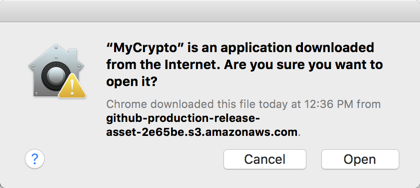
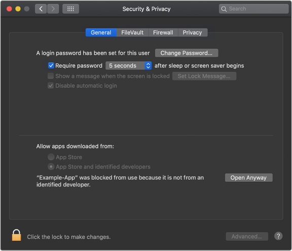
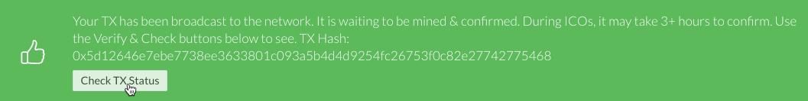

# Blockchain-Development

## Proof of Authority

The Proof-Of-Authority (PoA) is a consensus method that gives a small and designated number of blockchain actors the power to validate transactions or interactions with the network and to update its more or less distributed registry. The Proof of Authority model enables companies to maintain their privacy while availing the benefits of blockchain technology.

## Installation Steps

**Note**: The Operating System used is macOS. For security, most of the time permission will be needed to open and run applications. Go to Security & Privacy in System Preferences to allow permission when required. 

### Go Ethereum Tools

1. Download the ethereum tools from https://geth.ethereum.org/downloads/. [Go Ethereum](https://geth.ethereum.org/) is one of the three original implementations of the Ethereum protocol. It is written in Go, fully open-source and licensed under the GNU LGPL v3.
   - Follow the steps for your specific operation system
   - Installing in OS X ("Geth & Tools 1.9.7" recommended). 
   Click on the **"Geth & Tools 1.9.7"** to download the applications bundle archive.

 

2. Open your "Downloads" folder, and you will find a file named `geth-alltools-darwin-amd64-1.9.7-a718daa6.tar.gz` in OS X, and a file called `geth-alltools-windows-amd64-1.9.7-a718daa6.zip` in Windows. Note that the last numbers in the filename could vary depending on the last built available.

3. Decompress the file and rename the folder to **Blockchain-Tools** where you are comfortable accessing it from the terminal window like the user's home directory.

 

### MyCrypto App
1. Download the app from https://download.mycrypto.com/. [MyCrypto](https://www.mycrypto.com/) is a free, open-source, client-side interface that allows you to interact directly with the blockchain.
  - Follow the steps for your specific operation system. 
  - Drag the MyCrypto icon into Applications. 
  

  - Open the app and watch the tutorial on how to use it.

 **Note**: Remember to allow permission for the app to open (Check Security & Privacy for Mac). The first time you execute MyCrypto, you will see the following warning message, you can safely click on the "Open" button to start the application.

 

 ### Allowing Permission to Open Apps from Unidentified Developers

When an app is not registered with Apple, it can be automatically blocked by the Mac OS operating system when attempting to open the "unidentified" application. Therefore, in order to allow the use of the MyCrypto app, you may need to allow it as an exception to your Mac OS security preferences. To do so perform the following.

2. Open the MyCrypto app, it should produce a warning error saying that you cannot open the application due to security reasons. Therefore, we'll need to make a security exception for it.

3. Look to the top-left of the screen and click on the Apple Logo and navigate to System Preferences > Security & Privacy.

    

4. Click in the General tab and allow your MyCrypto application security access to be opened in the "Allow Apps Downloaded From" section. Your screen should look similar to the image below.

    

## Blockchain Creation Guide

**Note**: Proof of Authority Development

1. Open a terminal window
   - Choose the working environment
   - Navigate the Blockchain-Tools folder by running:  "cd Blockchain-Tools"
 
2. Create first node with datadir using geth by running: " ./geth account new --datadir nodename". Example: ./geth account new --datadir pdnode1. You will be prompted to choose a password and confirm it.
   - Save the password in a text file or remember it
   - Save the public address of the key and path to the secret file that will be generated
 
3. Run the same code for node 2, give it a name and follow the same process as node1. Example: ./geth account new --datadir pdnode2.

     

4. Initiate the puppeth (Etherum private network manager) to build your network and generate your genesis block.
   - Run: "./puppeth" 
   - Specify a network name to adminitrater by giving it a name. Exmaple: pdnet 

 
     

5.  Choose action to take when questions are prompted with different selections to choose from:
    - What would you like to do? Read and type 2 for "configure new genesis". 
    - For the next prompt type 1 for "create new genesis from scratch".
    - Which consensus engine to use? Type type 2 for "Clique - proof-of-authority". 
    - How many seconds should blocks take? Optional but in this case 10.

     

    - Which accounts are allowed to seal? Put account adress for node 1 and node 2 created before. 
    - Which accounts should be pre-funded? Put same account addresses. There are no block rewards in PoA, so you'll need to pre-fund.
    - Should the precompile-addresses (0x1 .. 0xff) be pre-funded with 1 wei? Choose no to keep the genesis cleaner.
    - Specify your chain/network ID if you want an explicit one: Any 3 digit numbers are good. Example 668

     

    - What would you like to do? Type 2 for "Manage existing genesis". Then Type 2 for "Export genesis configurations".
    - Which folder to save the genesis specs into? Just click enter and it will be save in the working folder. This will fail to create two of the files. Dont worry about the error, you only need networkname.json file.

The genesis block creation is completed, we will now initialize the nodes with the genesis' json file.

   
  
6. Exit puppeth by using the Ctrl+C keys combination.

7. Initiate each node with the new networkname.json using geth by running: 
   - ./geth init networkname.json --datadir node1name. Example: ./geth init pdnet.json --datadir pdnode1.
   - ./geth init networkname.json --datadir node2name. Example: ./geth init pdnet.json --datadir pdnode2.

     

8. Mine the blocks as the nodes are ready to use.
   - Open two new terminal windows. For node 1 run: "./geth --datadir account name --mine --minerthreads 1". Example: ./geth --datadir pdnode1 --mine --minerthreads 1. 
   - The --mine flag tells the node to mine new blocks.
   - The --minerthreads flag tells geth how many CPU threads, or "workers" to use during mining. Since our difficulty is low, we can set it to 1.
   - Scroll up in the terminal window where node1 is running, and copy the entire enode:// address (including the last @address:port segment) of the first node located in the Started P2P Networking. 
   - Save the P2P network info enode, example:                  self=enode://2432c46b9ef4d37a03800af57011745aa438ff68f6a307ca771bbad5a3a10b5e11fb73d651d449ffb9206d1d64d3465be7c7fcb8c6c58fb5180b3041c6eb9dac@127.0.0.1:30303
       
       

   - Set a different peer port for the second node and use the first node's enode address as the bootnode flag to let us talk to the chain via RPC.
   - Run the following code in the other terminal window: " ./geth --datadir node2 --port 30304 --rpc --bootnodes "enode://<replace with node1 enode address>". Example: ./geth --datadir pdnode2 --port 30304 --rpc --bootnodes "enode://2432c46b9ef4d37a03800af57011745aa438ff68f6a307ca771bbad5a3a10b5e11fb73d651d449ffb9206d1d64d3465be7c7fcb8c6c58fb5180b3041c6eb9dac@127.0.0.1:30303". The --rpc flag enables us to talk to our second node, which will allow us to use MyCrypto or Metamask to transact on our chain. Since the first node's sync port already took up 30303, we changed this one to 30304 using --port.

       

 **Note**: Alternative codes for Microsoft Windows: 
  -  ./geth --datadir node1 --unlock "SEALER_ONE_ADDRESS" --mine --rpc --allow-insecure-unlock
  - ./geth --datadir node2 --unlock "SEALER_TWO_ADDRESS" --mine --port 30304 --bootnodes "enode://SEALER_ONE_ENODE_ADDRESS@127.0.0.1:30303" --ipcdisable --allow-insecure-unlock
 
The nodes are now mining and producing new blocks.

**Reminder**: 
  - When running the first node, you may need to unlock the account to enable mining and the RPC flag. Only one node needs RPC enabled.
  - Remember, never share your mainnet private keys! This is a testnet, so coins have no value here!

## MyCryptop Custom Network Creation

1. Open MyCrypto app
2. Click on Change Network

 

3. Choose Add Custom Node.
   - Give the node a name
   - Choose Custom for the network (scroll dowm to locate the custom option)
   - Give the network a name: Same as node name
   - Choose **ETH** as currency
   - Add chain ID created when setting up the genesis. Example: 668

   

   - Add the URL: **https://127.0.0.1:8545/**. This points to the default RPC port on your local machine.
   - Click **Save & Use Custom Node** to finalize

   

   
 
## Transaction Testing with MyCrypto

1. Access yor wallet via the Keystore File. In this case, it will be the blockchain nodes wallet
   - Select **View & Send** from the menu pane
   - Choose Keystore File

   

   - Select Wallet File to navigate the location where the wallet was saved then the keystore directory inside your Node1 directory to upload the keystore
   - Enter the same password when the nodes was created. 
   - Click **Unlock**, this will open your account wallet inside MyCrypto.

   
 
2. Send a transaction to test if it is working
   - Enter recepient account address in the **To Address**. In this case, it will be the node 2 account address
   - Enter amount of choice
   - Click **Send transaction** then confirm the transaction by clicking **Send Transaction**, and the **Send** button in the pop-up window.

   
 
3. Click **Check TX Status** to view transaction details and status when the green message pops up, confirm the logout. You should see the transaction go from Pending to Successful in around the same blocktime you set in the genesis.

   

   

You have now completed the blockchain developmet process using proof of Authority, and you have used the MyCrypto app to send transactions. 

## Congratulations! You did it.

  
  
  
